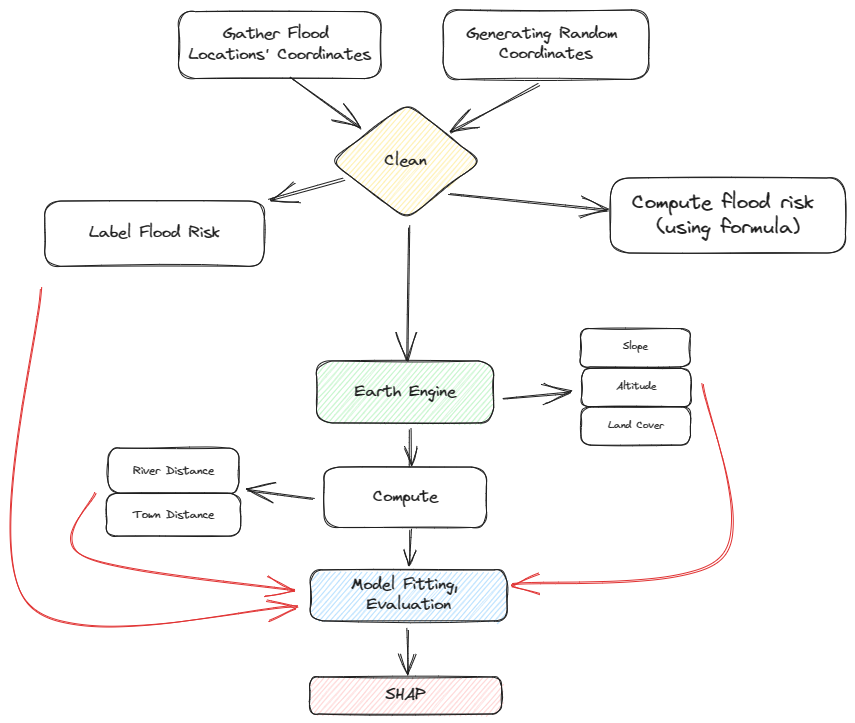

# Flood Risk Model 2


A flood risk model using logistic regression to predict flood risk for any location in Malaysia. The flood data is collected from the annual report published by the Department of Irrigation and Drainage from 2020-2021. The model is trained on 19,000 labelled random geo-coordinates in Malaysia.

## Objective
- To predict food risk for any location in Malaysia

## Methodology

For the second version of the flood risk model, more variables are included in the study compared to the previous [one](https://github.com/keanteng/flood_risk_model/tree/main) which is univariate. In this study, we include features such as elevation, slope, land cover, distance to the nearest town, distance to the nearest river and cluster, as follows:

```
target = distance_to_hist_floodsite + 
         altitude + 
         slope + 
         land_cover + 
         town_distance + 
         river_distance + 
         cluster + 
         error_term
```

Logistic regression shows great performance in the study with more than 98% accuracy and no sign of overfitting. State of the art-model like `XGBClassifier` is able to achieve a remarkable 100% accuracy.

### Data Collection

The labelled random coordinates were generated using `rancoord` a [Python package](https://github.com/hugodscarvalho/rancoord) that is capable of random sampling for geographic coordinates. To create labels for each coordinate, unique flood locations gathered from the 2020-2021 annual report published by the [Department of Irrigation and Drainage](https://www.water.gov.my/) were used to check whether the coordinate fall within 1.5 km radius of all the flood coordinates. 

Furthermore, the nearest distances between the random coordinates and the historical flood points were also computed using the `geopandas` module.

Features such as altitude, slope and land cover were collected by using [Google Earth Engine](https://developers.google.com/earth-engine/) services. For the land cover or land type, the information is gathered by using the [Copernicus Global Land Cover Layers](https://developers.google.com/earth-engine/datasets/catalog/COPERNICUS_Landcover_100m_Proba-V-C3_Global).

For town distances, 62 largest towns from [Wikipedia](https://en.wikipedia.org/wiki/List_of_cities_and_towns_in_Malaysia_by_population) were geocoded using [Nominatim](https://nominatim.openstreetmap.org/ui/search.html) and [Opencage](https://opencagedata.com/demo) geocoding services. The minimum distance between these towns and the random locations were computed. 

Moreover, to calculate the nearest river distance from the random coordinates, the waterways `shapefile` was collected from [HOTOSM Malaysia Waterways](https://data.humdata.org/dataset/hotosm_mys_waterways?). The distance between points (coordinate) and the polygon (waterways shape file) ware computed. 

K-means clustering was used to create 15 clusters class based on the latitude and the longitude of each coordinate. 

As a bonus to this study, [SHAP](https://shap.readthedocs.io/en/latest/index.html) or `SHapley Additive exPlanations` was used to break down a prediction to show the impact of each feature. 

## Computing Flood Risk
A flood risk study is also conducted to compute the flood risk for the locations (in area, not point) using the formula from [Development of Flood Risk Vulnerability Index for Critical Infrastructure in Malaysia](https://www.cidb.gov.my/wp-content/uploads/2022/11/Dev.-of-Flood-Risk-FVI-for-CI.pdf). The formulation is as follows:

```
R = sum(1/i * D)
```

The `R` is the flood risk, the `i` is the flood return interval and the `D` is the damage factor. The flood risk for an area is computed by iteratively sum the product of the inverse of flood return interval and damage factor for each pixel of the area of interest.

In the study, all the areas were assumed to have a size of `1500m x 1500m` which is equivalent to about `255 pixels` and with 15 houses inside the area. Here is how the damage factor is computed:
```
Total damage factor = 0.32 * (depth - mean_depth) + 
                      0.08 * (duration - mean_duration) + 
                      0.33 * (strata - mean_strata) + 
                      1
```

The default value published by the Condition of Flooding and Flood Damage Assessment:

```
mean_damange = 3274
mean_stata_value = 0.25 (urban = 1 and rural = 0)
mean_depth = 0.93
mean_duration = 2.83
```

The flood risk will be a score output with range varying from 0 to more than 20000 depending on the area of interest. The flood risk can then be put into a class, as follows:

| Range | Class|
|-------|------|
| < 50  | Very low risk|
| 51 -1000 | Low risk |
|1001-5000| Medium risk|
|5001-25000| High risk |
| >25000| Very high risk|

## Limitation
It was noticed that the logistic regression model prediction depend mainly on the distance to the historical flood point. This caused other feature to have minimal impact on the model. This was due to the assumption that all the flood area of coverage was the same. Further data collection was needed in this area.

The computation of flood risk using the iterative sum formula depend on a lot of assumptions, further data collection is needed to improve the result accuracy and reliability:
- Size of the area of interest
- Type of housing in the area of interest
    - Residential area, industrial area of institutional buildings
- Number of housing in the area of interest
- Size of housing in the area of interest
- Flood recurrent interval for the area of interest
- Flood depth for the area of interest

In the study, all the areas were assumed to be residential housing area which might not be true and accurate. Furthermore, for the damage factor, it was computed using the data from Condition of Flooding and Flood Damage Assessment, JPS published in 2012 for residential household. The data might not be accurate due to inflation and economy development.

## Workflow

<p style="text-align: center; color:grey;"><i>Project Workflows</i></p>

## References
1. Jati, M. I. H., Suroso, S., & Santoso, P. B. (2019). Prediction of flood areas using the logistic regression method (case study of the provinces Banten, DKI Jakarta, and West Java). Journal of Physics, 1367(1), 012087. https://doi.org/10.1088/1742-6596/1367/1/012087

Internship Project © 2023